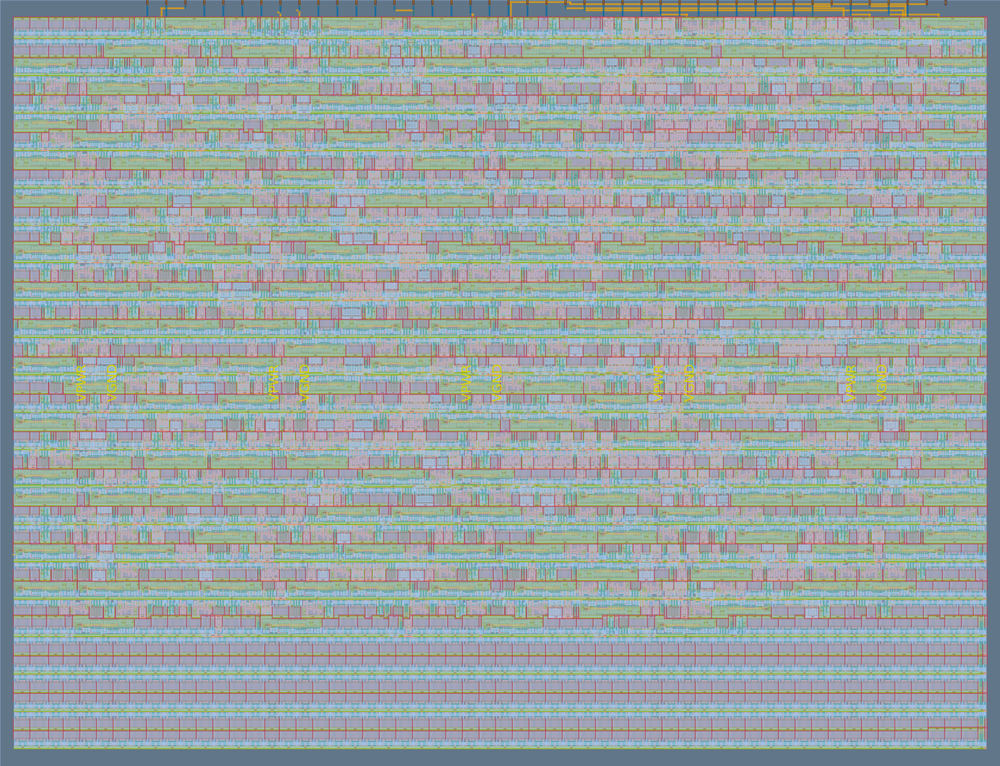
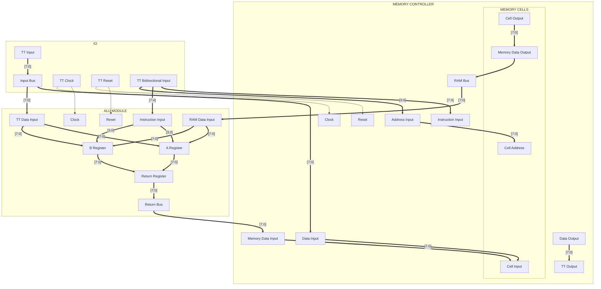

   

# EDLO: Experimental Direct Logical Operator

[Read the documentation for project](docs/info.md)

## What is EDLO?

The Experimental Direct Logical Operator (EDLO) chip is a CPU-like IC that can perform a couple arithmetic operations and has it's own RAM for data storage. It's nothing special, but for a first proper Tiny Tapeout project, it turned out much better (and more fun) than I originally anticipated, especially since my experience does not come from being as low level as assembly.

This project was heavily inspired by Ben Eater's breadboard computer (something I will eventually build myself when I get an oscilloscope), but does not function the same as there are a LOT of things missing from the original project and lots of changes had to be made to satisfy Yosys (looking at you bidirectional wires).

### Architecture

### Specs
- 1x1 tile space
- Uses 913 SG13G2 cells (according to Yosys)
- 8-bit architecture
- 16 bytes of addressable memory
- Add/subtract operations
- Runs up to 50MHz (theoretically)
- 10 functioning assembly instructions

Not very impressive, it's a proof of concept more than anything.

## Build this project yourself

1. Clone this repository
2. Go through the [local hardening setup instructions](https://www.tinytapeout.com/guides/local-hardening/) on the Tiny Tapeout website
3. While you have the `venv` activated and inside the root of the repository, run `./tt/tt_tool.py --harden --ihp`
4. If you want an image of the design in silicon, run `./tt/tt_tool.py --create-png` (use `--create-svg` if you just want the SVG)

## Resources I Used

### Tiny Tapeout
- [FAQ](https://tinytapeout.com/faq/)
- [Digital design lessons](https://tinytapeout.com/digital_design/)
- [Learn how semiconductors work](https://tinytapeout.com/siliwiz/)
- [Join the community](https://tinytapeout.com/discord)
- [Build your design locally](https://www.tinytapeout.com/guides/local-hardening/)

### Digital Electronics/Verilog
- [Ben Eater's 8-bit Breadboard Computer](https://youtube.com/playlist?list=PLowKtXNTBypGqImE405J2565dvjafglHU&si=xuY7RiUXlyZ-aaRR)
- [Shawn Hymel's FPGA Tutorials](https://youtube.com/playlist?list=PLEBQazB0HUyT1WmMONxRZn9NmQ_9CIKhb&si=d4Z5E0yJgwwUkm8L)
- [Chip Verify](https://chipverify.com)

### More ASIC resources
- [IEEE Columbus SSCS/CAS Local Verilog Simulation for Tiny Tapeout](https://youtu.be/f95Qanovx_c?si=oS5INqYEf7YdHsYO)
- [Psychogenic Technologies](https://youtube.com/playlist?list=PLWm3YS7ce87kaG0GkhW9uOMLDRcapD24D&si=Bawklf1fRug_yU2l)
- [Bitluni](https://youtu.be/DdF_nzMW_i8?si=DqmzXJnTln3ftXi-)

## Brief History

The EDLO chip started development as a request from a coworker of mine, but the original idea was formed when I first learned about Tiny Tapeout many years ago and wanted to create a very simple CPU; not to run Linux or anything complicated, just as a means to understand how CPUs actually work. Fast-forward a few years and I finally bit the bullet. While I was on a business trip to do field service for a certain semiconductor fabrication company, decided to use most of my off-time to design this chip and potentially get it run through a shuttle.

There were a few reasons why I only started now:
* A student on my robotics team was interested in ASIC design and was going to take a course run by a local university soon
* A coworker was interested in seeing what I was capable of designing after learning of my intrigue (this was many months ago and I only started last week lol, I'm sorry this took so long)
* I think low-level computing and electronics are neat
* Bought an FPGA and need to justify the purchase somehow (I didn't even use it during the development process despite bringing it with me)
* A couple folks from an aerospace group found it interesting, but didn't really have the time to dive into it
* If you say you design computer chips, people think you're smart

Despite starting late, this was a fun project where I learned, not so much about hardware design (that's when I get into analog design), but definitely a lot about Verilog, creating test benches, and using GTK Wave. If I were more creative, I would've probably learned more about actual design.
